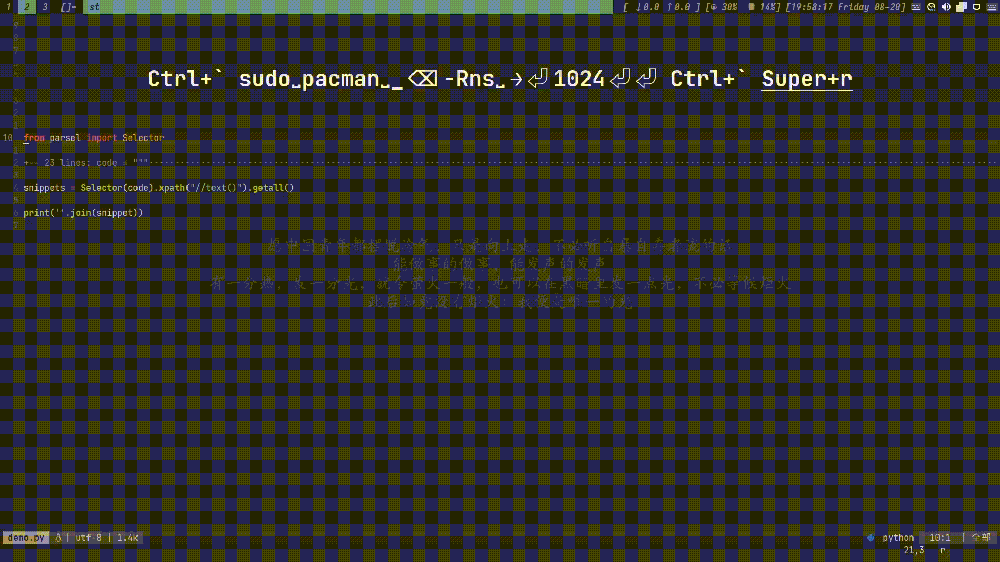

# CodeRunner.nvim


一个 NeoVim 插件，让你在浮动终端快速运行代码。

你可以:
+ 一键运行代码
+ 自定义运行任务
+ 隐藏终端，继续编辑
+ 运行后使用 Shell 命令
+ 用 Shell 快捷键（上下箭头）快速再次执行命令
## 安装

### packer.nvim

```lua
use {"Pu-gayhub/CodeRunner.nvim",
    config = function()
        require"CodeRunner".setup {
                -- 见下方配置
        }
    end
}
```

## 配置

```lua
require"CodeRunner".setup {
    -- 你可以在此处自定义不同语言的执行方式
    tasks = {
        c = "make", -- 可以是字符串，会发送到浮动终端执行
        python = "python <file>", -- 尖括号标记预定义变量。见下方变量。
        lua = function() -- 也可以执行一个函数
            vim.cmd("luafile %") -- 使用 VIM API
        end,
    },
    -- 此处可自定义浮动终端样式
    style = {
        -- 边框，见 `:help nvim_open_win`
        border = "rounded", -- 圆角边框
        -- 终端背景色
        bgcolor = "NONE", -- NONE 为透明
        -- 终端大小和位置，为百分数相对位置
        layout = {
            width = .8, -- 80% 编辑器大小
            height = .8,
            x = .5, -- 在编辑器中间
            y = .5
        }
    }
}
```


### 变量

因为可以使用函数和 shell 命令，绝大多数所需变量都可以通过外部程序配合获得，
所以 CodeRunner 不会提供很多变量

+ \<file\> 文件相对路经

### 键绑定

```lua
-- 使用 Ctrl+Alt+n 运行代码
keymap('n', "<C-A-n>", "<CMD>lua require'CodeRunner'.run()<CR>", {})
-- 使用 Ctrl+` 开关浮动终端
keymap('n', "<C-Space>", "<CMD>lua require'CodeRunner'.show()<CR>", {})
keymap('t', "<C-Space>", "<C-\\><C-n><CMD>lua require'CodeRunner'.hide()<CR>", {})
```

## 计划

+ [ ] 功能：以字符串直接使用 VIM CMD (通过特殊标记)
+ [ ] 选项：每次在一个新 Shell 中运行
+ [ ] 选项：运行前保存所有文件
+ [ ] 文档：英语文档

## 参考

[FTerm.nvim](https://github.com/numToStr/FTerm.nvim)

[VSCode CodeRunner](https://github.com/formulahendry/vscode-code-runner)

